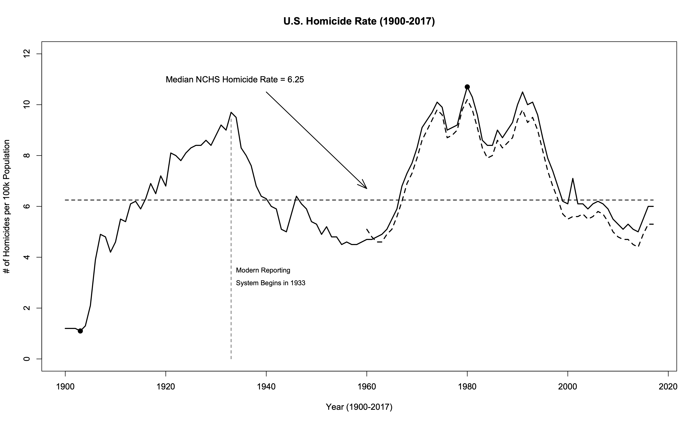

### U.S. Homicide Data 

<p align="center">

</p>

* Code to generate plot

```R
year <- seq(from=1900,to=2017,by=1)

hrate <- c(1.2,1.2,1.2,1.1,1.3,2.1,
  3.9,4.9,4.8,4.2,4.6,5.5,5.4,6.1,
  6.2,5.9,6.3,6.9,6.5,7.2,6.8,8.1,
  8,7.8,8.1,8.3,8.4,8.4,8.6,8.4,
  8.8,9.2,9,9.7,9.5,8.3,8,7.6,6.8,
  6.4,6.3,6,5.9,5.1,5,5.7,6.4,6.1,
  5.9,5.4,5.3,4.9,5.2,4.8,4.8,4.5,
  4.6,4.5,4.5,4.6,4.7,4.7,4.8,4.9,
  5.1,5.5,5.9,6.8,7.3,7.7,8.3,9.1,
  9.4,9.7,10.1,9.9,9,9.1,9.2,10,
  10.7,10.3,9.6,8.6,8.4,8.4,9,8.7,
  9,9.3,10,10.5,10,10.1,9.6,8.7,7.9,
  7.4,6.8,6.2,6.1,7.1,6.1,6.1,5.9,
  6.1,6.2,6.1,5.9,5.5,5.3,5.1,5.3,
  5.1,5.0,5.5,6.0,6.0)

ucr <- c(rep(NA,60),5.1,4.8,4.6,4.6,
  4.9,5.1,5.6,6.2,6.9,7.3,7.9,8.6,
  9,9.4,9.8,9.6,8.7,8.8,9,9.8,10.2,
  9.8,9.1,8.3,7.9,8,8.6,8.3,8.5,8.7,
  9.4,9.8,9.3,9.5,9,8.2,7.4,6.8,6.3,
  5.7,5.5,5.6,5.6,5.7,5.5,5.6,5.8,
  5.7,5.4,5,4.8,4.7,4.7,4.5,4.4,4.9,5.3,5.3)
 
nchs <- data.frame(year,hrate,ucr)
nchs

median(nchs$hrate)
median(nchs$ucr,na.rm=T)

plot(x=nchs$year,y=nchs$hrate,
  type="l",lty=1,lwd=2,
  ylim=c(0,12),
  xlab="Year (1900-2017)",
  ylab="# of Homicides per 100k Population",
  main="U.S. Homicide Rate (1900-2017)")
points(x=1903,y=1.1,pch=19,cex=1.2)
points(x=1980,y=10.7,pch=19,cex=1.2)
lines(x=nchs$year,y=nchs$ucr,lty=2,lwd=2)
segments(x0=1900,y0=median(nchs$hrate),
         x1=2017,y1=median(nchs$hrate),lty=2,lwd=1.5)
text(x=1920,y=11,adj=c(0,0.5),"Median NCHS Homicide Rate = 6.25")
arrows(x0=1940,y0=10.5,x1=1960,y1=6.7,
       lty=1,lwd=1.5,angle=20,length=0.2)
segments(x0=1933,y0=0,x1=1933,y1=9.5,lty=2,lwd=0.8)
text(x=1934,y=3.5,adj=c(0,0.5),cex=0.8,
  "Modern Reporting")
text(x=1934,y=3.0,adj=c(0,0.5),cex=0.8,
  "System Begins in 1933")
```

* Calculations

```Rout
> year <- seq(from=1900,to=2017,by=1)
> 
> hrate <- c(1.2,1.2,1.2,1.1,1.3,2.1,
+   3.9,4.9,4.8,4.2,4.6,5.5,5.4,6.1,
+   6.2,5.9,6.3,6.9,6.5,7.2,6.8,8.1,
+   8,7.8,8.1,8.3,8.4,8.4,8.6,8.4,
+   8.8,9.2,9,9.7,9.5,8.3,8,7.6,6.8,
+   6.4,6.3,6,5.9,5.1,5,5.7,6.4,6.1,
+   5.9,5.4,5.3,4.9,5.2,4.8,4.8,4.5,
+   4.6,4.5,4.5,4.6,4.7,4.7,4.8,4.9,
+   5.1,5.5,5.9,6.8,7.3,7.7,8.3,9.1,
+   9.4,9.7,10.1,9.9,9,9.1,9.2,10,
+   10.7,10.3,9.6,8.6,8.4,8.4,9,8.7,
+   9,9.3,10,10.5,10,10.1,9.6,8.7,7.9,
+   7.4,6.8,6.2,6.1,7.1,6.1,6.1,5.9,
+   6.1,6.2,6.1,5.9,5.5,5.3,5.1,5.3,
+   5.1,5.0,5.5,6.0,6.0)
> 
> ucr <- c(rep(NA,60),5.1,4.8,4.6,4.6,
+   4.9,5.1,5.6,6.2,6.9,7.3,7.9,8.6,
+   9,9.4,9.8,9.6,8.7,8.8,9,9.8,10.2,
+   9.8,9.1,8.3,7.9,8,8.6,8.3,8.5,8.7,
+   9.4,9.8,9.3,9.5,9,8.2,7.4,6.8,6.3,
+   5.7,5.5,5.6,5.6,5.7,5.5,5.6,5.8,
+   5.7,5.4,5,4.8,4.7,4.7,4.5,4.4,4.9,5.3,5.3)
>  
> nchs <- data.frame(year,hrate,ucr)
> nchs
    year hrate  ucr
1   1900   1.2   NA
2   1901   1.2   NA
3   1902   1.2   NA
4   1903   1.1   NA
5   1904   1.3   NA
6   1905   2.1   NA
7   1906   3.9   NA
8   1907   4.9   NA
9   1908   4.8   NA
10  1909   4.2   NA
11  1910   4.6   NA
12  1911   5.5   NA
13  1912   5.4   NA
14  1913   6.1   NA
15  1914   6.2   NA
16  1915   5.9   NA
17  1916   6.3   NA
18  1917   6.9   NA
19  1918   6.5   NA
20  1919   7.2   NA
21  1920   6.8   NA
22  1921   8.1   NA
23  1922   8.0   NA
24  1923   7.8   NA
25  1924   8.1   NA
26  1925   8.3   NA
27  1926   8.4   NA
28  1927   8.4   NA
29  1928   8.6   NA
30  1929   8.4   NA
31  1930   8.8   NA
32  1931   9.2   NA
33  1932   9.0   NA
34  1933   9.7   NA
35  1934   9.5   NA
36  1935   8.3   NA
37  1936   8.0   NA
38  1937   7.6   NA
39  1938   6.8   NA
40  1939   6.4   NA
41  1940   6.3   NA
42  1941   6.0   NA
43  1942   5.9   NA
44  1943   5.1   NA
45  1944   5.0   NA
46  1945   5.7   NA
47  1946   6.4   NA
48  1947   6.1   NA
49  1948   5.9   NA
50  1949   5.4   NA
51  1950   5.3   NA
52  1951   4.9   NA
53  1952   5.2   NA
54  1953   4.8   NA
55  1954   4.8   NA
56  1955   4.5   NA
57  1956   4.6   NA
58  1957   4.5   NA
59  1958   4.5   NA
60  1959   4.6   NA
61  1960   4.7  5.1
62  1961   4.7  4.8
63  1962   4.8  4.6
64  1963   4.9  4.6
65  1964   5.1  4.9
66  1965   5.5  5.1
67  1966   5.9  5.6
68  1967   6.8  6.2
69  1968   7.3  6.9
70  1969   7.7  7.3
71  1970   8.3  7.9
72  1971   9.1  8.6
73  1972   9.4  9.0
74  1973   9.7  9.4
75  1974  10.1  9.8
76  1975   9.9  9.6
77  1976   9.0  8.7
78  1977   9.1  8.8
79  1978   9.2  9.0
80  1979  10.0  9.8
81  1980  10.7 10.2
82  1981  10.3  9.8
83  1982   9.6  9.1
84  1983   8.6  8.3
85  1984   8.4  7.9
86  1985   8.4  8.0
87  1986   9.0  8.6
88  1987   8.7  8.3
89  1988   9.0  8.5
90  1989   9.3  8.7
91  1990  10.0  9.4
92  1991  10.5  9.8
93  1992  10.0  9.3
94  1993  10.1  9.5
95  1994   9.6  9.0
96  1995   8.7  8.2
97  1996   7.9  7.4
98  1997   7.4  6.8
99  1998   6.8  6.3
100 1999   6.2  5.7
101 2000   6.1  5.5
102 2001   7.1  5.6
103 2002   6.1  5.6
104 2003   6.1  5.7
105 2004   5.9  5.5
106 2005   6.1  5.6
107 2006   6.2  5.8
108 2007   6.1  5.7
109 2008   5.9  5.4
110 2009   5.5  5.0
111 2010   5.3  4.8
112 2011   5.1  4.7
113 2012   5.3  4.7
114 2013   5.1  4.5
115 2014   5.0  4.4
116 2015   5.5  4.9
117 2016   6.0  5.3
118 2017   6.0  5.3
> 
> median(nchs$hrate)
[1] 6.25
> median(nchs$ucr,na.rm=T)
[1] 6.85
> 
> plot(x=nchs$year,y=nchs$hrate,
+   type="l",lty=1,lwd=2,
+   ylim=c(0,12),
+   xlab="Year (1900-2017)",
+   ylab="# of Homicides per 100k Population",
+   main="U.S. Homicide Rate (1900-2017)")
> points(x=1903,y=1.1,pch=19,cex=1.2)
> points(x=1980,y=10.7,pch=19,cex=1.2)
> lines(x=nchs$year,y=nchs$ucr,lty=2,lwd=2)
> segments(x0=1900,y0=median(nchs$hrate),
+          x1=2017,y1=median(nchs$hrate),lty=2,lwd=1.5)
> text(x=1920,y=11,adj=c(0,0.5),"Median NCHS Homicide Rate = 6.25")
> arrows(x0=1940,y0=10.5,x1=1960,y1=6.7,
+        lty=1,lwd=1.5,angle=20,length=0.2)
> segments(x0=1933,y0=0,x1=1933,y1=9.5,lty=2,lwd=0.8)
> text(x=1934,y=3.5,adj=c(0,0.5),cex=0.8,
+   "Modern Reporting")
> text(x=1934,y=3.0,adj=c(0,0.5),cex=0.8,
+   "System Begins in 1933")
> 
```
