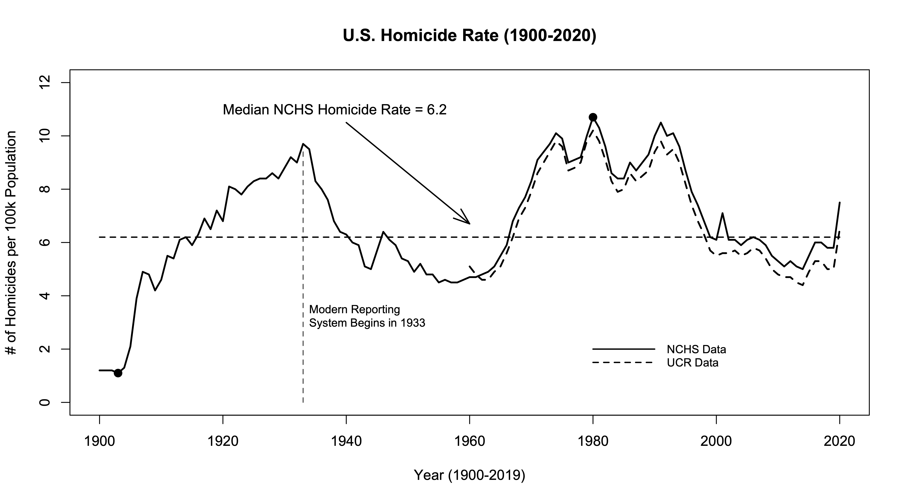

### U.S. Homicide Data 

<p align="center">

</p>

* Code to generate plot

```R
year <- seq(from=1900,to=2022,by=1)

hrate <- c(1.2,1.2,1.2,1.1,1.3,2.1,
  3.9,4.9,4.8,4.2,4.6,5.5,5.4,6.1,
  6.2,5.9,6.3,6.9,6.5,7.2,6.8,8.1,
  8,7.8,8.1,8.3,8.4,8.4,8.6,8.4,
  8.8,9.2,9,9.7,9.5,8.3,8,7.6,6.8,
  6.4,6.3,6,5.9,5.1,5,5.7,6.4,6.1,
  5.9,5.4,5.3,4.9,5.2,4.8,4.8,4.5,
  4.6,4.5,4.5,4.6,4.7,4.7,4.8,4.9,
  5.1,5.5,5.9,6.8,7.3,7.7,8.3,9.1,
  9.4,9.7,10.1,9.9,9,9.1,9.2,10,
  10.7,10.3,9.6,8.6,8.4,8.4,9,8.7,
  9,9.3,10,10.5,10,10.1,9.6,8.7,7.9,
  7.4,6.8,6.2,6.1,7.1,6.1,6.1,5.9,
  6.1,6.2,6.1,5.9,5.5,5.3,5.1,5.3,
  5.1,5.0,5.5,6.0,6.0,5.8,5.8,7.5,7.8,7.5)

ucr <- c(rep(NA,60),5.1,4.8,4.6,4.6,
  4.9,5.1,5.6,6.2,6.9,7.3,7.9,8.6,
  9,9.4,9.8,9.6,8.7,8.8,9,9.8,10.2,
  9.8,9.1,8.3,7.9,8,8.6,8.3,8.5,8.7,
  9.4,9.8,9.3,9.5,9,8.2,7.4,6.8,6.3,
  5.7,5.5,5.6,5.6,5.7,5.5,5.6,5.8,
  5.7,5.4,5,4.8,4.7,4.7,4.5,4.4,4.9,
  5.3,5.3,5.0,5.1,6.5,6.8,6.3)
 
nchs <- data.frame(year,hrate,ucr)
nchs

median(nchs$hrate,na.rm=T)
median(nchs$ucr,na.rm=T)

plot(x=nchs$year,y=nchs$hrate,
  type="l",lty=1,lwd=2,
  ylim=c(0,12),
  xlab="Year (1900-2022)",
  ylab="# of Homicides per 100k Population",
  main="U.S. Homicide Rate (1900-2022)")
points(x=1903,y=1.1,pch=19,cex=1.2)
points(x=1980,y=10.7,pch=19,cex=1.2)
lines(x=nchs$year,y=nchs$ucr,lty=2,lwd=2)
segments(x0=1900,y0=median(nchs$hrate,na.rm=T),
         x1=2022,y1=median(nchs$hrate,na.rm=T),lty=2,lwd=1.5)
text(x=1920,y=11,adj=c(0,0.5),"Median NVSS Homicide Rate = 6.3")
arrows(x0=1940,y0=10.5,x1=1960,y1=6.7,
       lty=1,lwd=1.5,angle=20,length=0.2)
segments(x0=1933,y0=0,x1=1933,y1=9.5,lty=2,lwd=0.8)
text(x=1934,y=3.5,adj=c(0,0.5),cex=0.8,
  "Modern NVSS Reporting")
text(x=1934,y=3.0,adj=c(0,0.5),cex=0.8,
  "System Begins in 1933")
segments(x0=1980,x1=1990,y0=2,y1=2,lty=1,lwd=1.5)
text(x=1992,y=2,adj=c(0,0.5),cex=0.8,"NVSS Data")
segments(x0=1980,x1=1990,y0=1.5,y1=1.5,lty=2,lwd=1.5)
text(x=1992,y=1.5,adj=c(0,0.5),cex=0.8,"UCR Data")
```

#### Notes

* Historical NCHS homicide rates obtained from this [link](http://web.archive.org/web/20101207003843/http://bjs.ojp.usdoj.gov/content/glance/tables/hmrttab.cfm).
* Historical UCR homicide rates obtained from this [link](http://web.archive.org/web/20120812001236/http://bjs.ojp.usdoj.gov/content/homicide/tables/totalstab.cfm)
* Contemporary NCHS homicide rates obtained from this [link](https://wonder.cdc.gov/controller/datarequest/D76).
* Contemporary UCR homicide rates obtained from this [link](https://www.fbi.gov/services/cjis/ucr).
* Modern national mortality series began in 1933; Source: [link](https://www.ncbi.nlm.nih.gov/pmc/articles/PMC10257439/)).
